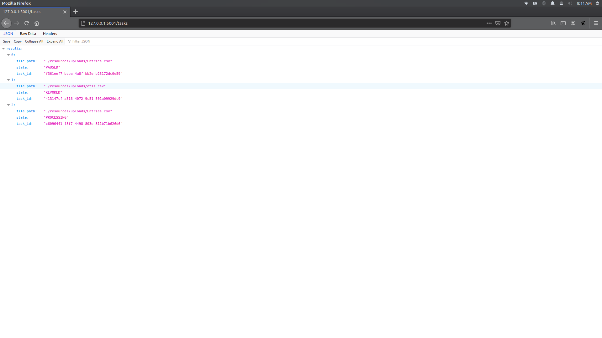
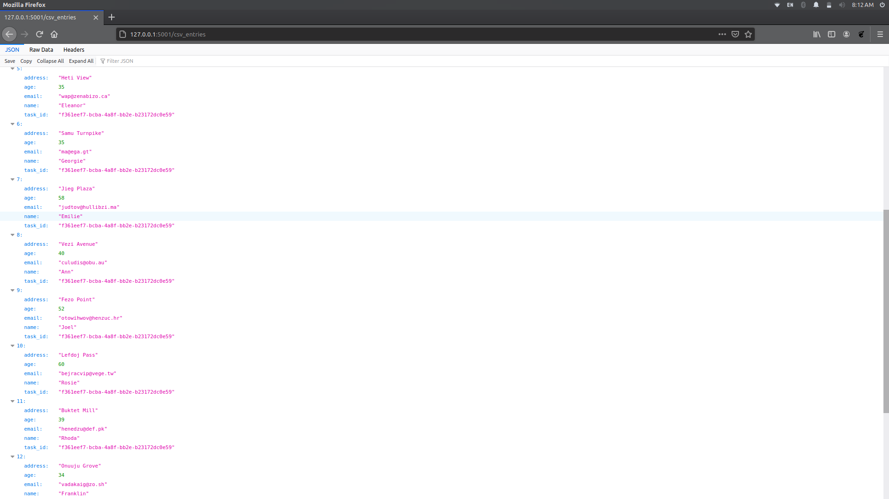

# Task Description

Atlan Collect is a data collection platform that is currently being used by a lot of big organisations over the world. Problem statement asks to develop a solution so that user can terminate, pause and resume the long running tasks. For this API endpoints are developed to start, terminate, pause and resume a long running tasks (importing to database from a CSV in this case). The developed solution is packaged in a docker container.

# Technology Stack 
Proposed solution uses the following technologies and dependencies:
  - Flask (backend framework)
  - SQLite (relational database)
  - SQLAlchemy (object relational mapper)
  - Celery (asynchronous task queue)
  - Redis (message broker)
  - Docker (containerization)
  - Supervisord (process control)

# Working

  - Firstly https://www.convertcsv.com/generate-test-data.htm is used to generate dummy data for our task. Generated CSV files are present in ```resources/uploads```folder and can be used for testing the application.
  - Celery is used as a task queue, whenever a user submits a request to import the data to database from CSV file, we create add a new entry in ```Tasks``` table in database and give it ```PROCESSING``` state.
  - Since the tasks in queues are asynchronous we can change their states using ```update_state(...)``` function.
  - These states are changed using API endpoints and are monitored using ```AsyncResult(...).state``` function and writing to the database is accordingly taken care of.


# Working with respect to example cases in the Problem Statement

  - Solution developed in the repository can handle the issue in Example 1 without any changes. As the task in the example 1 was to pause, terminate and resume import operation to DB from an uploaded CSV file, our solution offers all 3 functionalities using API endpoints mentioned below.
  - Example 3 in the statement is also a case of Example 1 now with our terminate API endpoint user can stop the terminate the task and the database entry by the terminated tasks will also be deleted. After that one can upload the correct CSV.
  - Example 2 is also very similar to the 1 and 3, we can consider export to the Dashboard as write operations to the Dashboard table/DB. This export is equivalent to copying of data points from one DB (collect DB) to another (dashboard DB). Since our solution handles the copying from CSV to DB we can easily extend it to the case in Example 2.


# API Endpoints
### ```/```
API endpoint to accept a file for upload and starts the task


### ```/tasks```
This returns all the tasks that were called, revoked or paused by the user



### ```/csv_entries```
Returns all the entries imported in database (```CsvEntries``` table) (only for representation purposes)



### ```/pause/<task_id>```
Pause the task of the given ```task_id```. ```PAUSED``` tasks can be resumed in the future. When task is paused the last processed row number (```last_row```) of CSV file is saved with the task_id in the ```PausedTasks``` table.


### ```/terminate/<task_id>```
Terminate or Revoke the task of the given ```task_id```. ```REVOKED``` tasks can't be resumed in the future. When a task is terminated the entries made by the task on the ```CsvEntries``` table is also deleted.


### ```/resume/<task_id>```
Resume the ```PAUSED``` task of given ```task_id```. When this API point is called the CSV import resumes from the ```last_row``` where task was paused.


### ```/terminated_tasks```
Lists all ```REVOKED``` tasks


### ```/paused_tasks```
Lists all ```PAUSED``` tasks


# Installation (Using Docker)

Make sure Docker is installed on your system and just execute this command, you can access the application on ```localhost:5001``` now.

```sh
$ sudo docker-compose up --build
```

# Installation (Locally)

Start your virtual environment and install all the dependencies.

```sh
$ pip3 install -r requirements.txt
```

Refer this link to install and start Redis Server locally https://redis.io/topics/quickstart.

After Redis installation you can start the Flask Application using

```sh
$ python3 run.py
```

Start the celery worker using and you can access the application on the ```localhost:5001``` 

```sh
$ python3 worker.py
```

### Todos

 - Make resume function more efficient by improving skipping of rows
 - Add exception handling wherever missed

